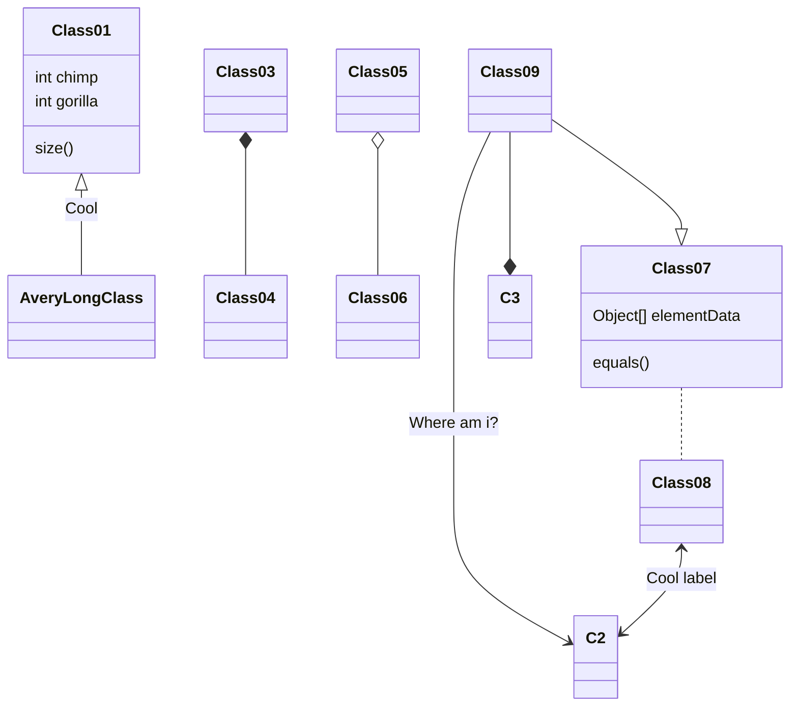

# pit1
prufugeymsla fyrir skolann

1. [Tilvísun](#tilvísun)
1. [listi](#listar)
    1. [óraðaður listi](#óraðaður-listi)
    1. [raðaður listi](#raðaður-listi)
1. [Tafla](#tafla)
1. [mynd og annað](#linkar-kóði-og-rest)

## Tilvísun 
> hér er tilvísun í eitthvað

## Listar

### Óraðaður listi
- hlutur 1
- hlutur 2
- hlutur 3
    - undirliður 1
    - undirliður 2
        - undirliður 3
- hlutur 4

### Raðaður listi
1. hlutur 1
1. hlutur 2
    1. undirliður 1
    1. undirliður 2
    1. undirliður 2
    1. undirliður 2
    1. undirliður 2 
    1. undirliður 2

## Tafla
haus 1 | haus 2 | haus 3 
:--: | :---: | :---: 
12 | 36 | 45
abc | ahhhhhh| bbbbkjj


## Linkar, kóði og rest

[Hér](https://tskoli.is/) er heimasíða tækniskólans.
<!-- hér fyrir neðan er kóðinn fyrir arduino -->
```arduino 
void setup() {
    Serial.begin(9600);
    Serial.println("Halló");
}
```


**feitletraður \*texti** 

*skáletrað*




~~gegnumstrikað~~

hh


hvaða text er þetta?
